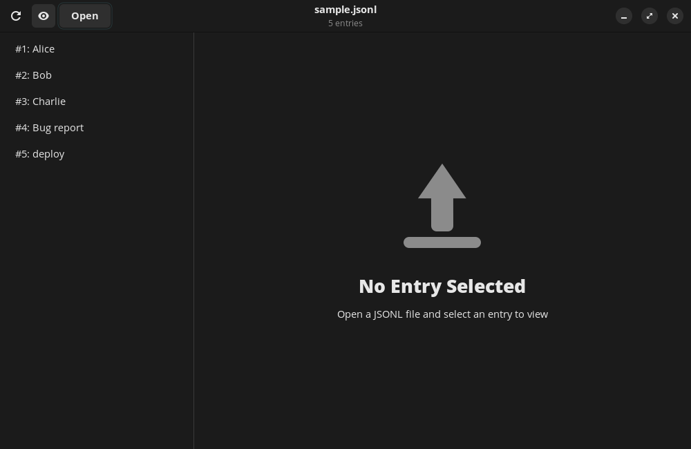
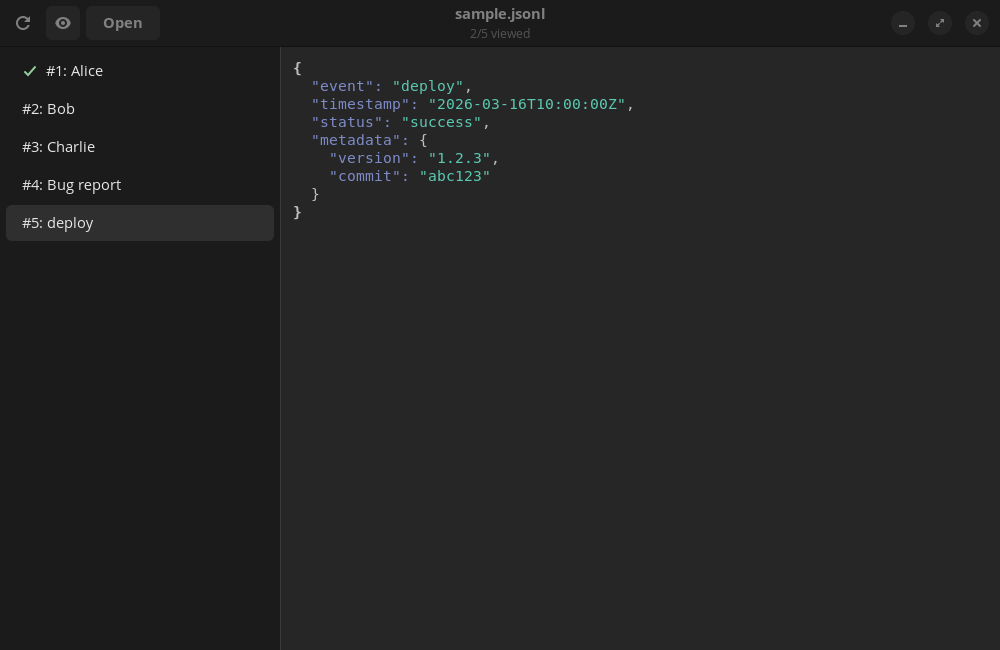

# jsonl-viewer

A GNOME desktop app for browsing and inspecting JSONL/NDJSON files.

- **Syntax-highlighted** JSON detail view (GtkSourceView)
- **Smart sidebar** labels extracted from common keys (`name`, `title`, `id`, etc.)
- **Right-click any key** in the JSON to use it as the sidebar label — persisted per file
- **Live file watching** with incremental append for streaming logs
- **Manual reload** via Ctrl+R





[Full documentation](https://jorjives.github.io/jsonl-viewer/) · [GitHub](https://github.com/jorjives/jsonl-viewer)

## Requirements

- Python 3
- GTK 4, libadwaita, GtkSourceView 5
- Linux (GNOME or any GTK 4-compatible desktop)

## Install

```bash
git clone https://github.com/jorjives/jsonl-viewer.git
cd jsonl-viewer
./install.sh
```

The install script creates a symlink in `~/.local/bin`, registers the desktop entry, and sets up MIME types for `.jsonl` and `.ndjson` files.

## Install from .deb

Download the latest `.deb` from [GitHub Releases](https://github.com/jorjives/jsonl-viewer/releases/latest):

```bash
sudo apt install ./jsonl-viewer_*_all.deb
```

## Uninstall

If installed via .deb:

```bash
sudo apt remove jsonl-viewer
```

If installed via install.sh:

```bash
rm ~/.local/bin/jsonl-viewer
rm ~/.local/share/applications/dev.jorj.jsonl-viewer.desktop
rm ~/.local/share/mime/packages/jsonl-viewer.xml
rm ~/.local/share/icons/hicolor/scalable/apps/dev.jorj.jsonl-viewer.svg
rm ~/.local/share/icons/hicolor/scalable/apps/dev.jorj.jsonl-viewer-symbolic.svg
update-mime-database ~/.local/share/mime
update-desktop-database ~/.local/share/applications
gtk-update-icon-cache ~/.local/share/icons/hicolor
```

## Usage

Open a file from the command line or file manager:

```bash
jsonl-viewer data.jsonl
```

Or launch the app and use the Open button.

## Development

After cloning, set up git hooks:

```bash
git config core.hooksPath .githooks
```
