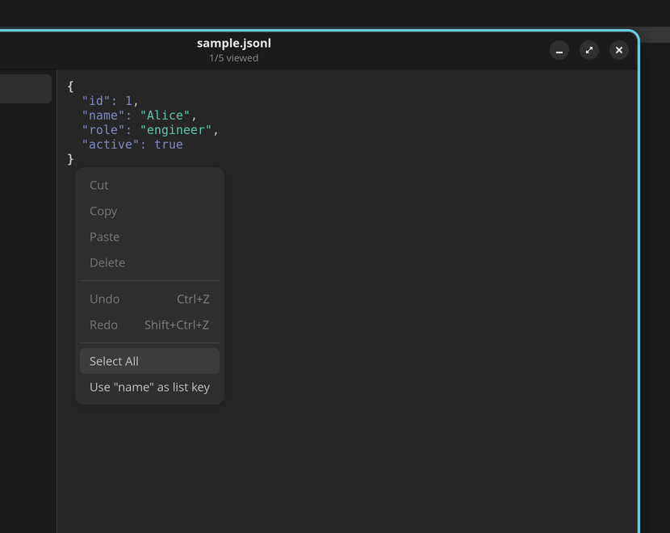

# User Guide

## Opening files

There are three ways to open a JSONL file:

- **From the command line:** `jsonl-viewer data.jsonl`
- **From the app:** click the **Open** button in the header bar — a file dialog appears with a JSONL/NDJSON filter
- **From your file manager:** double-click any `.jsonl` or `.ndjson` file (MIME types are registered during installation)

## Browsing entries

The left sidebar shows one row per JSON object in the file.

- Labels are automatically extracted from common keys: `name`, `title`, `id`, `type`, `message`, `event`, `key`, `label`
- If none of those keys exist, the first key-value pair is shown
- Each entry shows its line number (e.g., `#1: Alice`)
- A tick mark appears next to entries you have already viewed

## Inspecting JSON

Click an entry in the sidebar to see its full JSON in the detail pane.

- JSON is pretty-printed with syntax highlighting (GtkSourceView)
- The colour scheme follows your system light/dark theme
- The header bar shows how many entries you have viewed (e.g., "2/5 viewed")

## Customising sidebar labels

The automatic label detection works well for most files, but you can override it:

1. Select an entry to view its JSON in the detail pane
2. **Right-click** any top-level key (e.g., `"role"`)
3. Select **"Use [key] as list key"** from the context menu
4. All sidebar labels update immediately to show the value of that key

Your choice is saved per file in `~/.config/jsonl-viewer/key-prefs.json`. A confirmation toast appears when the key is changed.

To revert to automatic detection, right-click again and select **"Reset to automatic"**.

## Live file watching

Click the **watch toggle** button in the header bar to enable file watching.

- New lines appended to the file appear in the sidebar automatically
- If the file is truncated (e.g., log rotation), the app reloads it from scratch
- If the file is deleted, watching stops and a notification appears
- Press **Ctrl+R** to manually reload the file at any time
